# 28 套住宅设计风格图谱

> 用途：让人能够审阅我们究竟把什么知识交给了 Aily，而不是只看到一份风格名称列表。
> 版本：V1 research atlas · 2026-08-12
> 对应机器语料：`app/src/catalog/design-style-corpus.js`

## 我总结出的核心结论

这 28 套不是 28 个可直接套用的“滤镜”，而是 28 组具有不同空间秩序、材料倾向、家具体量、光线组织和维护成本的设计方向。Aily 应先用它们理解住户，再生成候选方案；不能只根据一个风格名替用户决定整套住宅。

我的理解分成四层：

1. **空间骨架**：开放还是围合、对称还是自由、低矮还是厚重、是否强调室内外关系。
2. **装修系统**：墙、顶、地、门窗、固定木作与照明如何共同形成风格，而不只是换家具。
3. **软装语言**：家具比例、织物、颜色、装饰密度与焦点如何组织。
4. **执行边界**：预算、维护、工艺、气候和户型是否允许；哪些“看起来像”的做法其实会做廉价。

因此，Aily 对每套风格都至少要能输出：`layout / palette / materials / envelope / furniture / lighting / methods / avoid`。风格只负责软偏好；承重、消防、净距、机电、门窗和生产规则仍由确定性的规则层校验。

## 怎么读这份图谱

- **图片**用于快速辨认空间气质，不是可直接商用的产品资产。
- **知识来源**用于支持文字特征；优先采用博物馆、公共机构和专业设计媒体。
- 标记为“视觉检索 / 可能为合成图”的图片只用于辨识，不作为历史或技术事实证据。
- **Aily 可执行翻译**是我们自己的产品化理解，后续应变成结构化 prompt、工具参数和规则检查。
- “风水”没有被算作第 29 套风格。它是一层可选文化约束，只有住户主动选择后才启用，且不能覆盖安全、结构、人体工学或企业规则。

## 28 套总览

| # | 风格 | 最明显的识别点 | Aily 的首要控制项 |
|---:|---|---|---|
| 01 | 北欧 | 浅木、自然光、轻体量、功能优先 | 通透与隐藏收纳 |
| 02 | 日式北欧 | 低矮、留白、天然材料、安静 | 降低高度和表面光泽 |
| 03 | 极简主义 | 连续界面、极少物件、精准收口 | 先解决收纳再做减法 |
| 04 | 当代风 | 中性基底与当期材料的克制混搭 | 防止短期趋势铺满全屋 |
| 05 | 中世纪现代 | 胡桃木、低矮家具、室内外联系 | 控制复古单品比例 |
| 06 | 包豪斯 | 功能、几何、工业材料、结构可读 | 形式服从使用逻辑 |
| 07 | 工业风 | 裸露结构、砖/钢/混凝土、开放 | 以木和织物修正冷硬 |
| 08 | 粗野主义 | 纪念性体块、混凝土、深阴影 | 户型尺度与采光适配 |
| 09 | 静奢 | 少而精、天然材料、细腻收口 | 对缝、五金和低眩光 |
| 10 | 孟菲斯后现代 | 高彩、异形、非对称、舞台感 | 保留一个主焦点 |
| 11 | 装饰艺术 | 对称、黑金/宝石色、几何镶嵌 | 轴线与材质层次 |
| 12 | 新艺术 | 植物曲线、彩玻璃、整体工艺 | 让结构与装饰一体化 |
| 13 | 新古典主义 | 中轴、线脚、比例、浅色石膏 | 按空间模数控制装饰 |
| 14 | 传统欧陆 | 正式房间序列、深木、古典轮廓 | 新旧家具而非整套复制 |
| 15 | 法式乡村 | 奶油色、旧木、柔和曲线、松弛 | 避免假做旧与过甜 |
| 16 | 英式乡村 | 壁炉、书柜、花纹叠加、舒适角落 | 用重复色管理丰富度 |
| 17 | 地中海 | 白灰泥、陶土、拱口、通风 | 室内外与手工表面 |
| 18 | 西班牙殖民 | 厚墙、拱门、深木梁、铁艺 | 保留厚重结构感 |
| 19 | 托斯卡纳 | 石/灰泥/陶砖、餐厨聚会、暖土色 | 材料真实，避免满屋褐黄 |
| 20 | 维多利亚极繁 | 宝石色、壁纸、收藏、繁复线脚 | 建立主次与重复色 |
| 21 | 侘寂 | 不完美、土色、旧木、柔和侧光 | 区分自然痕迹与施工缺陷 |
| 22 | 新中式 | 轴线、框景、格栅、明式比例 | 用空间秩序替代符号堆贴 |
| 23 | 海岸风 | 沙色、雾蓝、浅木、通风 | 轻盈而不主题公园化 |
| 24 | 农舍风 | 家庭餐桌、耐用表面、新旧混搭 | 日常维护与家庭活动优先 |
| 25 | 原木粗犷 | 石、厚木、自然边、火炉感 | 真实粗材料而非贴皮 |
| 26 | 波西米亚折衷 | 收藏、图案、藤木、自由组合 | 用重复材质收住混搭 |
| 27 | 摩洛哥 | zellige、雕花灰泥、马蹄拱、低座 | 工艺与围合感 |
| 28 | 巴厘热带 | 跨通风、深檐、庭院、木石藤 | 气候适配和耐湿性 |

---

## 01. 北欧风 Scandinavian

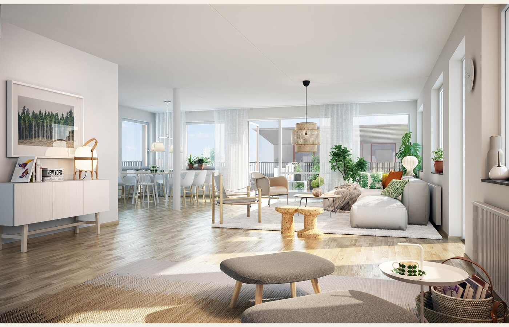

**视觉理解**：它不是“全白”，而是以自然光、浅木和低视觉重量创造容易生活的空间。家具线条清楚、腿部轻、通道连续，少量织物和植物负责回温。

**装修与布置**：暖白或浅灰墙顶，浅橡木地面；玻璃和轻木作减少阻挡；收纳尽量隐藏，但常用物保留少量开放位置。照明以自然光和漫射暖光为主。

**Aily 可执行翻译**：优先检查采光、主通道和收纳；生成方案时降低家具视觉重量，避免深色大柜连续封堵；若用户要“更温暖”，先增加羊毛、亚麻、木纹和局部暖光，而不是整屋改黄。

**容易做丑**：只有白色而没有材质层次；把所有家具都换成细腿小件导致收纳和舒适度不足。

**适合**：中小户型、重视采光和日常维护的家庭。
知识来源：[Denmark.dk — Danish design](https://denmark.dk/innovation-and-design/design/) · 图片来源：[Visit Skåne](https://visitskane.com/design-shopping/must-see-list-design-lovers)

## 02. 日式北欧 Japandi

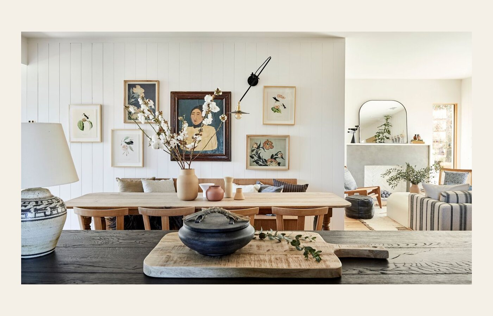

**视觉理解**：北欧的功能性与日式的留白、低矮、手工感结合。安静不是靠“空”，而是靠统一的低饱和材料和有限的物件高度。

**装修与布置**：米灰、土褐、墨色点缀；木、石、纸、棉麻和藤；石灰洗墙或哑光木面。家具低矮、有机，表面不过度抛光。

**Aily 可执行翻译**：控制家具高度线、表面反射率和可见物数量；保留自然材料的小缺陷；优先提出“低矮开放”与“稍多收纳”两个合法方向，而不是默认清空。

**容易做丑**：把空间做成灰米色样板间；为了留白牺牲真实收纳；大量仿藤和廉价木纹。

**适合**：偏安静、低物欲、愿意维持整洁的住户。
知识与图片来源：[Architectural Digest — Japandi Style 101](https://www.architecturaldigest.com/story/japandi-style-101)

## 03. 极简主义 Minimalist

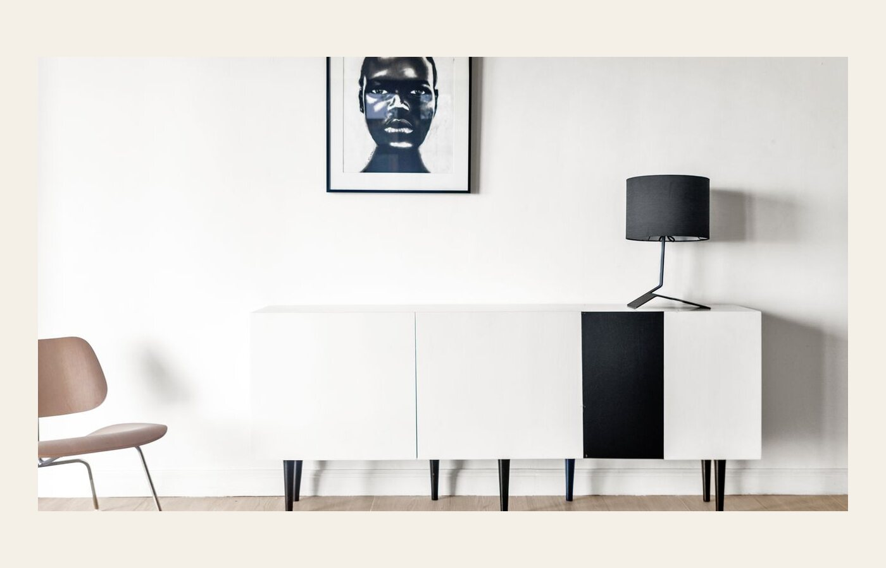

**视觉理解**：极简的成本主要在“看不见的部分”——整合收纳、设备、缝隙和节点，而不是删掉家具。

**装修与布置**：单色或低饱和中性；连续墙面、隐藏门和无拉手柜；木、石、玻璃、哑光金属；灯具退到建筑界面中。

**Aily 可执行翻译**：先计算物品容量和设备位置，再建议连续柜体；统一门缝、踢脚、收边和色温；物件少但比例必须准确。

**容易做丑**：廉价收口暴露；没有储藏空间；把“空”误当成高端。

**适合**：预算允许做定制收口、物品管理习惯稳定的住户。
知识与图片来源：[Architectural Digest — Minimalist Interior Design 101](https://www.architecturaldigest.com/story/minimalist-interior-design-101)

## 04. 当代风 Contemporary

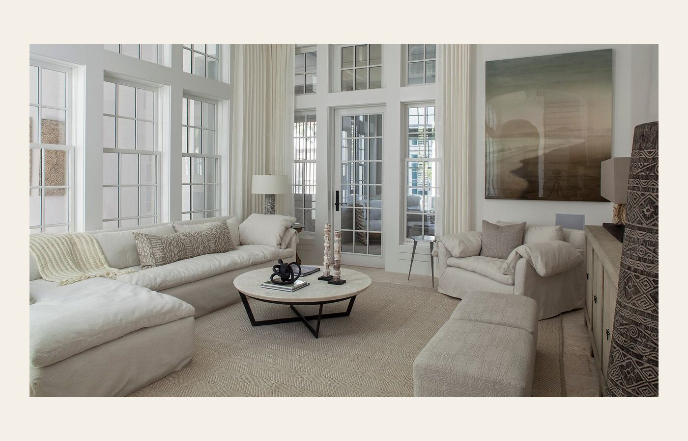

**视觉理解**：不是固定历史样式，而是把当前生活方式、材料和艺术单品组织在干净的中性基底上。

**装修与布置**：开放或混合格局；中性色为主，一处强调色；木、石、金属、织物混合；建筑光与装饰灯并用。

**Aily 可执行翻译**：先锁定长期不变的基底，再把趋势放在可替换的家具、灯具和艺术品上；每个房间只保留一到两个当代焦点。

**容易做丑**：追逐流行材料，导致两年后整体过时；每个角落都使用不同“网红元素”。

**适合**：希望现代但不想被单一风格约束的住户。
知识与图片来源：[Architectural Digest — Contemporary Interior Design 101](https://www.architecturaldigest.com/story/contemporary-interior-design-101)

## 05. 中世纪现代 Mid-century Modern

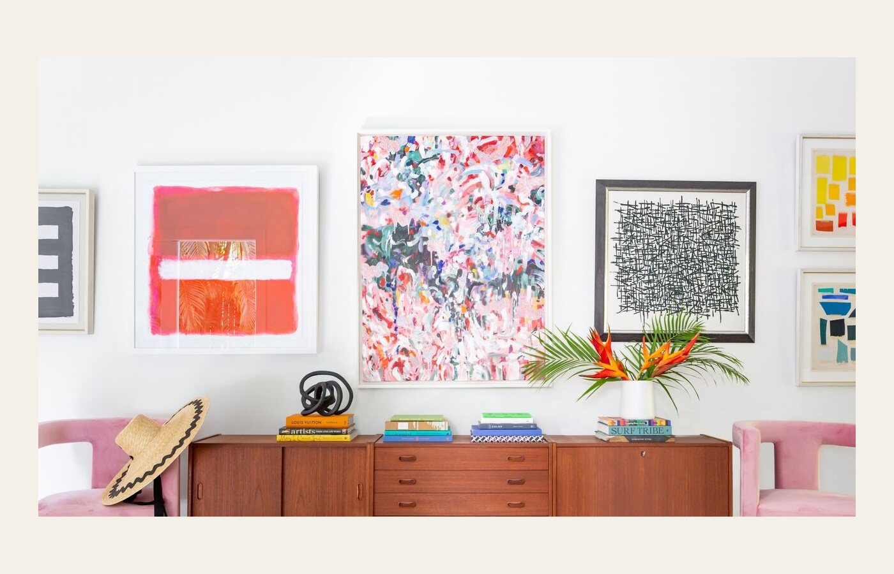

**视觉理解**：低矮家具、清楚的结构、胡桃木色与室内外联系。重点是比例和经典单品，不是把住宅做成复古展厅。

**装修与布置**：胡桃木、柚木、皮革和玻璃；芥末黄、橄榄绿、砖红点缀；锥形腿、几何曲线、球形或雕塑灯具。

**Aily 可执行翻译**：保持窗边视线开放；用 1–3 件复古轮廓单品建立风格，其余壳体保持当代；校验老式尺度是否符合今天的人体工学。

**容易做丑**：整套复制、颜色过度橙棕、用廉价贴皮模拟胡桃木。

**适合**：喜欢温暖现代感、收藏家具和艺术品的住户。
知识与图片来源：[Architectural Digest — Midcentury Modern Basics](https://www.architecturaldigest.com/story/midcentury-modern-decor-basics-that-every-beginner-should-know)

## 06. 包豪斯 Bauhaus

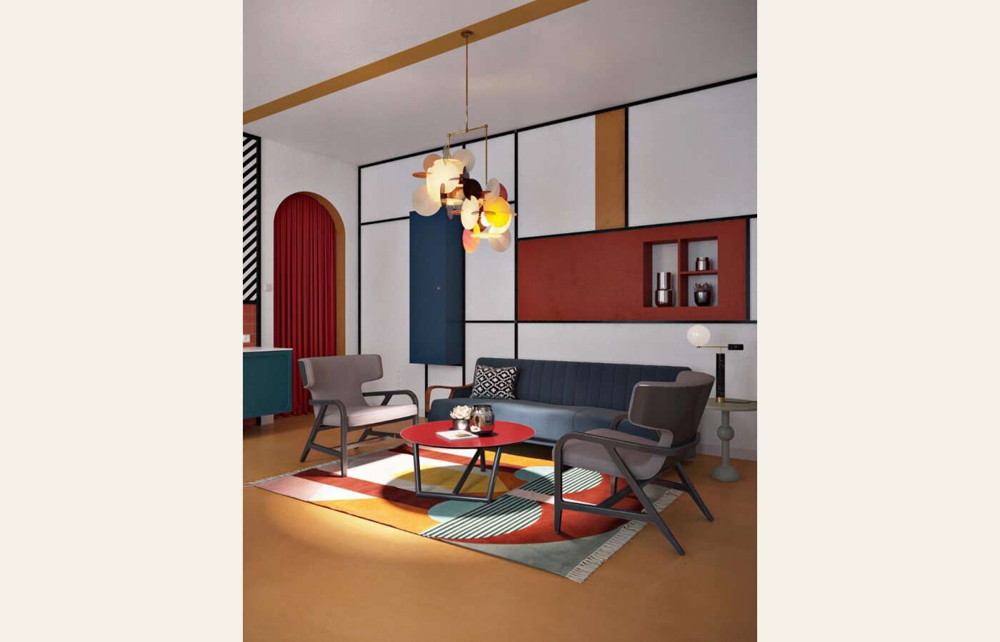

**视觉理解**：核心是功能、工业生产与结构可读，不是“三原色加几何图案”。

**装修与布置**：白黑灰基底，红黄蓝少量点缀；管状钢、玻璃、皮革；平整无装饰表面；家具几何、可批量生产。

**Aily 可执行翻译**：每个造型必须对应功能或构造；让结构、连接和材料边界清楚；色彩只用于识别或焦点，不做全屋主题。

**容易做丑**：复制符号，却没有功能逻辑；三原色遍布空间；忽视舒适性。

**适合**：偏理性、接受冷静工业材料的住户。
知识来源：[MoMA — Bauhaus](https://www.moma.org/collection/terms/bauhaus) · 图片来源：[Artofit — Bauhaus Interior](https://www.artofit.org/image-gallery/bauhaus-interior-design/)（视觉检索）

## 07. 工业风 Industrial

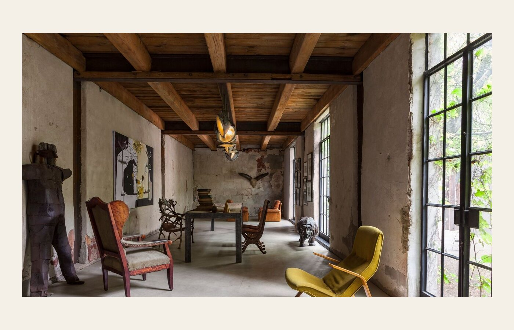

**视觉理解**：保留结构和服务系统，利用粗糙材料与开放尺度建立真实感。

**装修与布置**：混凝土、砖、钢、旧木和皮革；炭灰、锈色、深木；轨道灯或工厂型吊灯；家具耐用、体量偏大。

**Aily 可执行翻译**：仅在真实可解释的位置暴露管线或结构；用木、地毯、窗帘和暖光抵消声学与冷硬问题；小户型自动降低深色比例。

**容易做丑**：假砖墙、装饰性假管道；采光差的房间全部灰黑化。

**适合**：层高较高、开放格局、接受粗质感的住户。
知识与图片来源：[Architectural Digest — Industrial Interior Design 101](https://www.architecturaldigest.com/story/industrial-interior-design-101)

## 08. 粗野主义 Brutalist

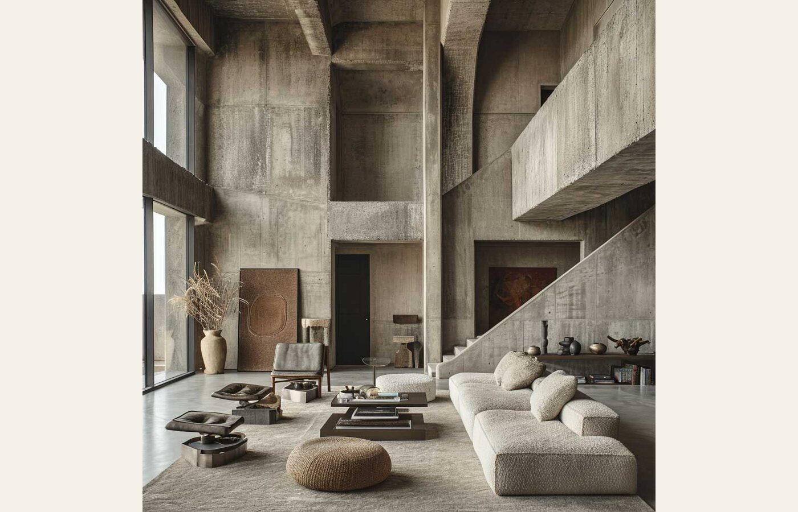

**视觉理解**：以结构、体块、重量和深阴影构成空间；它比工业风更纪念性、更少装饰。

**装修与布置**：清水混凝土、粗石、钢和厚木；大连续质感面；家具厚重几何、接近雕塑。

**Aily 可执行翻译**：先检查层高、面积和采光；小空间只允许局部粗野主义焦点；增加柔软接触面和声学材料。

**容易做丑**：低层高小户型照搬巨大体块；全灰且没有光影层次。

**适合**：大开间、强烈审美取向、可承担材质施工的住户。
知识来源：[MoMA — Brutalist Architecture](https://www.moma.org/collection/terms/brutalist-architecture) · 图片来源：[Pinterest 搜索结果](https://mx.pinterest.com/pin/197243658675012637/)（仅视觉辨识）

## 09. 静奢 Quiet Luxury

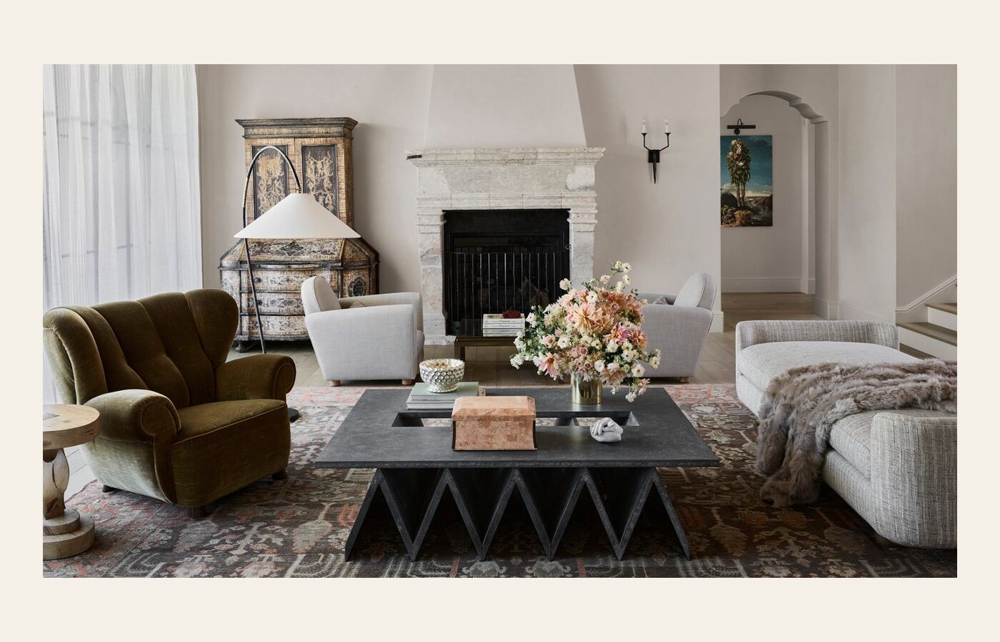

**视觉理解**：高级感来自比例、天然材料、触感、对缝和五金，而不是 logo、金色或米色本身。

**装修与布置**：奶油、燕麦、灰褐；天然石、实木、羊毛、亚麻、哑光金属；连续木作和分层暖光。

**Aily 可执行翻译**：把预算优先给高频接触面、五金、收口和灯光；减少可见物；统一门缝、留缝和材料转折。

**容易做丑**：全屋米色却材料廉价；贴皮、假石和粗五金暴露。

**适合**：预算较高、重视长期耐看与触感的住户。
知识与图片来源：[Vogue — Quiet Luxury Interiors](https://www.vogue.com/article/quiet-luxury-interiors-trend)

## 10. 孟菲斯后现代 Memphis / Postmodern

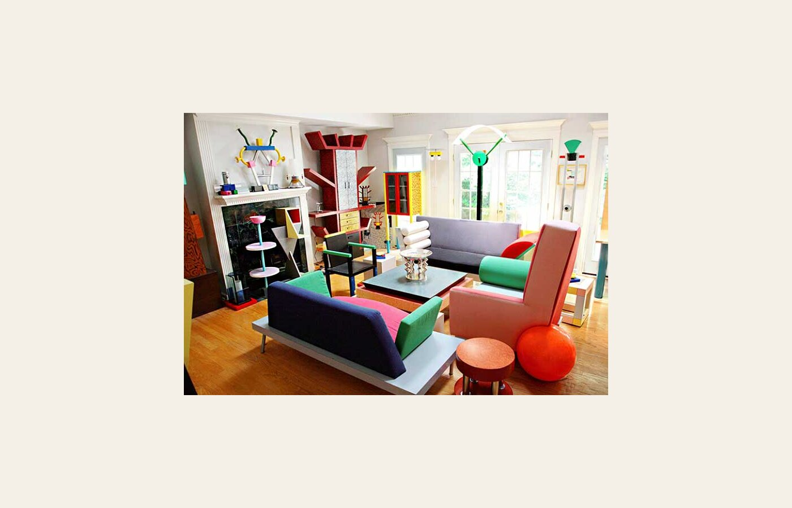

**视觉理解**：通过反常规比例、高彩和几何冲突制造幽默与舞台感，是主动反对“正确品味”的表达型风格。

**装修与布置**：高纯度粉、蓝、黄与黑白图形；层压板、彩色金属、塑料和图案织物；异形家具、非对称布局。

**Aily 可执行翻译**：限定一个主舞台和一组重复图形；其余界面退为中性；提供低强度、中强度两个版本供住户选择。

**容易做丑**：所有面都抢注意力；把儿童房配色误当孟菲斯；图形没有重复秩序。

**适合**：愿意表达个性、接受高视觉刺激的住户或局部空间。
知识来源：[V&A — What is Postmodernism?](https://www.vam.ac.uk/articles/what-is-postmodernism) · 图片来源：[Decofilia — Estilo Memphis](https://decofilia.com/estilo-memphis/)（视觉检索）

## 11. 装饰艺术 Art Deco

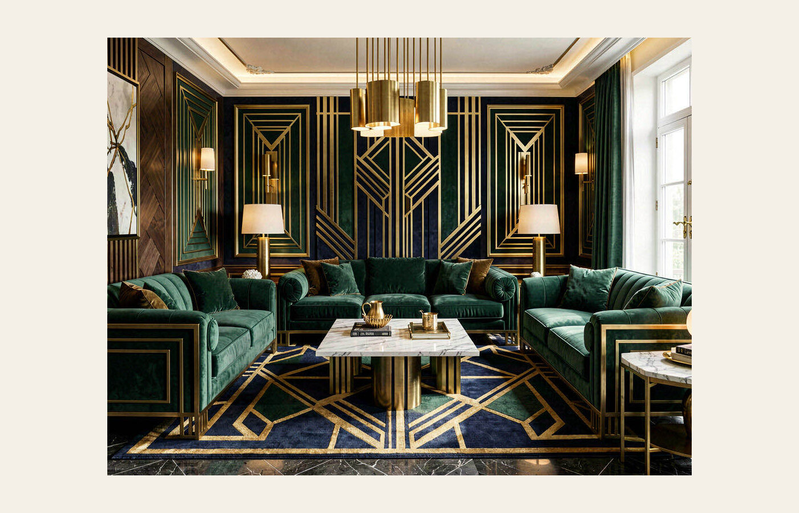

**视觉理解**：强轴线、对称、几何和奢华材料形成仪式感；关键是层次，不是“黑金豪装”。

**装修与布置**：黑金、祖母绿、奶油和宝石色；黄铜、漆面、镜面、大理石、深木；放射纹、阶梯线和镶嵌。

**Aily 可执行翻译**：先建立轴线和成对关系，再分配金属、镜面和宝石色的占比；控制反射面和眩光；焦点集中在一面或一个序列。

**容易做丑**：金色和高光无层次堆叠；廉价石纹与镜面过量。

**适合**：偏正式、重视仪式感与夜间氛围的住户。
知识来源：[V&A — An Introduction to Art Deco](https://www.vam.ac.uk/articles/an-introduction-to-art-deco) · 图片来源：[Remodeled AI — Art Deco](https://www.remodelai.io/styles/art-deco)（合成视觉示意，不作史实证据）

## 12. 新艺术 Art Nouveau

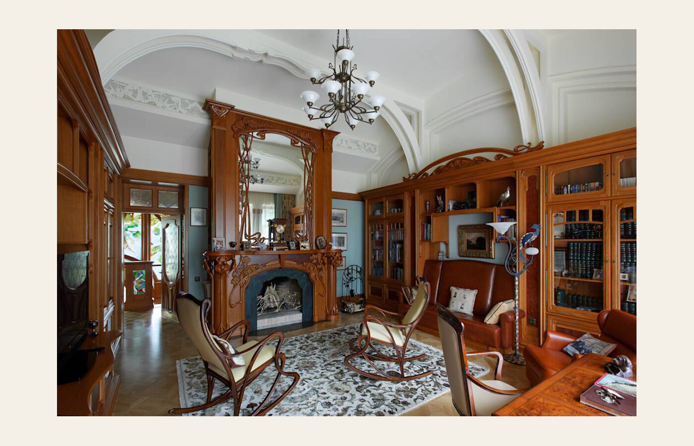

**视觉理解**：植物、曲线和手工艺从墙面延伸到家具、玻璃与金属，让结构与装饰成为一个整体。

**装修与布置**：曲木、锻铁、彩绘玻璃、陶瓷；植物绿、琥珀和柔和宝石色；藤蔓线条、曲线家具、彩玻璃灯。

**Aily 可执行翻译**：只在能做连续曲线和真实工艺的构件上使用；让两到三种有机线条重复；不要用印花贴图代替空间构造。

**容易做丑**：廉价 floral 贴纸；曲线彼此无关；工艺预算不足却强行全屋复刻。

**适合**：喜欢手工、植物和历史艺术感，且接受定制成本的住户。
知识来源：[V&A — Art Nouveau](https://www.vam.ac.uk/articles/art-nouveau-an-international-style) · 图片来源：[Porusski — Art Nouveau Interior](https://porusski.me/2018/05/01/063-modern-v-interere/)（视觉检索）

## 13. 新古典主义 Neoclassical

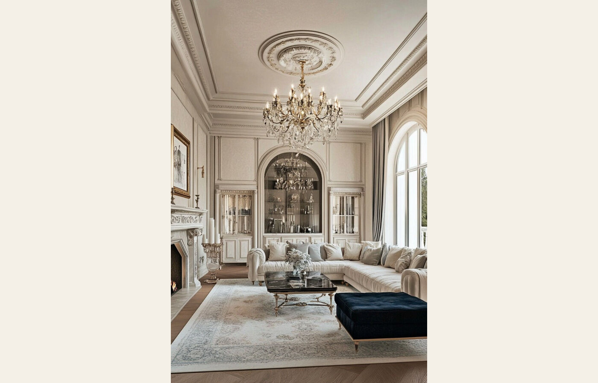

**视觉理解**：以比例、轴线和古典模数建立秩序，装饰应服从房间尺度。

**装修与布置**：象牙白、浅灰、浅蓝和少量金；石膏、大理石、深浅木；柱式、壁柱、檐口和护墙板。

**Aily 可执行翻译**：先识别中心线、开口和墙面分格；根据层高限制线脚宽度与数量；家具成组但不过度厚重。

**容易做丑**：小尺度房间使用巨大柱式；线脚没有模数；金色过量。

**适合**：重视秩序、正式会客和端正比例的住户。
知识来源：[The Met — Neoclassicism](https://www.metmuseum.org/essays/neoclassicism) · 图片来源：[Pinterest 搜索结果](https://in.pinterest.com/pin/742179213632926186/)（仅视觉辨识）

## 14. 传统欧陆 Traditional European

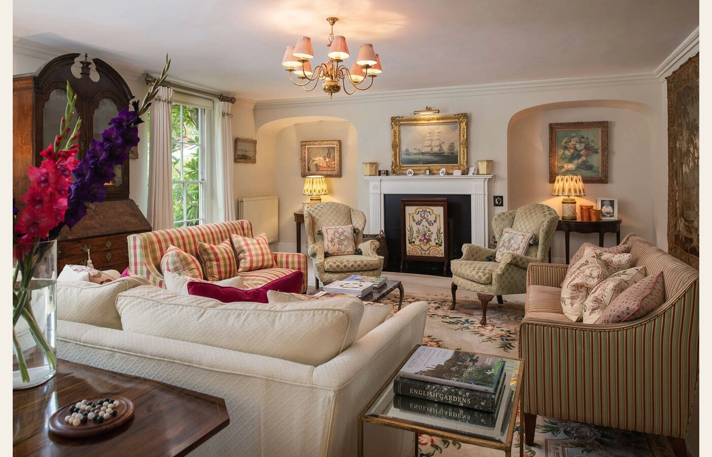

**视觉理解**：正式房间序列、壁炉或轴线焦点、深木和层叠织物共同形成长期居住感。

**装修与布置**：暖中性、深木、暗红绿蓝；实木、羊毛、亚麻、天鹅绒和黄铜；线脚、木地板、古典轮廓家具。

**Aily 可执行翻译**：先定义房间焦点与会客关系；用新旧混合而非整套同色家具；照明由吊灯、壁灯、台灯分层。

**容易做丑**：全屋成套家具；暗色过量；复制宫廷符号而没有生活痕迹。

**适合**：喜欢正式、耐久、收藏与传统家庭氛围的住户。
知识来源：[Architectural Digest — Traditional Interior Design 101](https://www.architecturaldigest.com/story/traditional-interior-design-101) · 图片来源：[Vicarage House](https://www.vicaragehousenorfolk.com/the-house)

## 15. 法式乡村 French Provincial

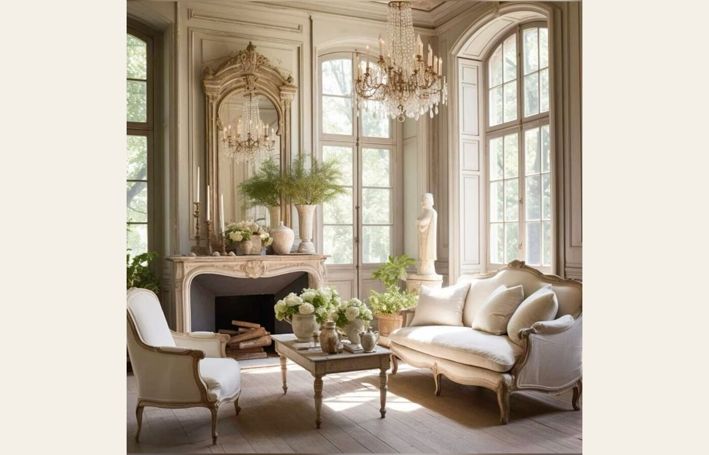

**视觉理解**：乡村材料的松弛感与法式家具的精致曲线并存，温柔但不甜腻。

**装修与布置**：奶油、浅黄、浅蓝、鼠尾草绿；旧木、石、亚麻和棉；木梁、旧木地或石地；弧线家具和做旧柜。

**Aily 可执行翻译**：保留一到两个精致焦点，其余用朴素材料；做旧必须对应真实磨损位置；织物图案控制在同一色域。

**容易做丑**：假做旧、碎花过量、所有家具都弯腿雕花。

**适合**：偏温柔、自然、希望空间有生活痕迹的住户。
知识来源：[Architectural Digest — French Country Decor 101](https://www.architecturaldigest.com/story/french-country-decor-101) · 图片来源：[Pinterest 视觉合集](https://www.pinterest.com/caritalairdlrci/french-provincial-home/)（仅视觉辨识）

## 16. 英式乡村 English Country

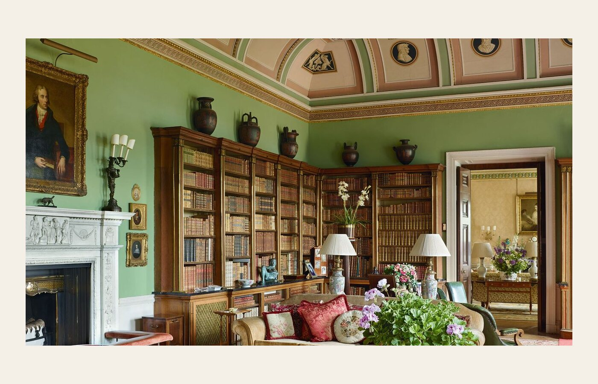

**视觉理解**：围绕壁炉、阅读、交谈和收藏形成舒适角落，丰富但不是随机堆满。

**装修与布置**：暖黄、苔绿、暗红；旧木、羊毛、棉麻、陶瓷；壁纸、木地板、地毯；大沙发、古董和书柜。

**Aily 可执行翻译**：先建立阅读/交谈功能组；花纹、条纹、格纹必须共享重复色；预留书、摆件和日常杂物收纳。

**容易做丑**：没有收纳计划的摆件堆积；花纹没有主次；把昏暗误当温暖。

**适合**：爱阅读、收藏、重视包裹感和长期生活痕迹的家庭。
知识与图片来源：[House & Garden — English Country House Style](https://www.houseandgarden.co.uk/gallery/english-country-house-style)

## 17. 地中海风 Mediterranean

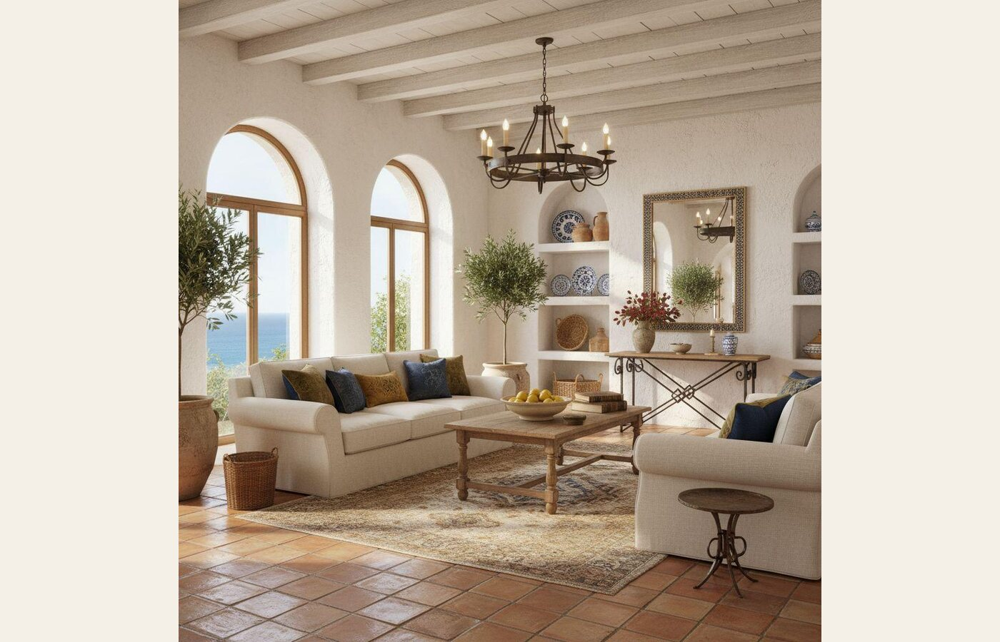

**视觉理解**：室内外连通、厚质感灰泥、陶土和拱形开口共同服务于日光与通风。

**装修与布置**：白、陶土、海蓝、橄榄绿；灰泥、陶砖、石、铁艺和木；白色抹灰墙、陶土地面、露梁。

**Aily 可执行翻译**：优先处理自然通风、遮阳和开口关系；蓝色只做局部；用真实手工表面而非海洋主题道具。

**容易做丑**：船舵、锚和蓝白条纹堆满；忽略气候和防潮。

**适合**：采光好、重视室内外生活与自然材料的住户。
知识来源：[Architectural Digest — Mediterranean Interior Design 101](https://www.architecturaldigest.com/story/mediterranean-interior-design-101) · 图片来源：[Decor8 AI — Mediterranean](https://www.decor8.ai/styles/mediterranean)（合成视觉示意）

## 18. 西班牙殖民 Spanish Colonial

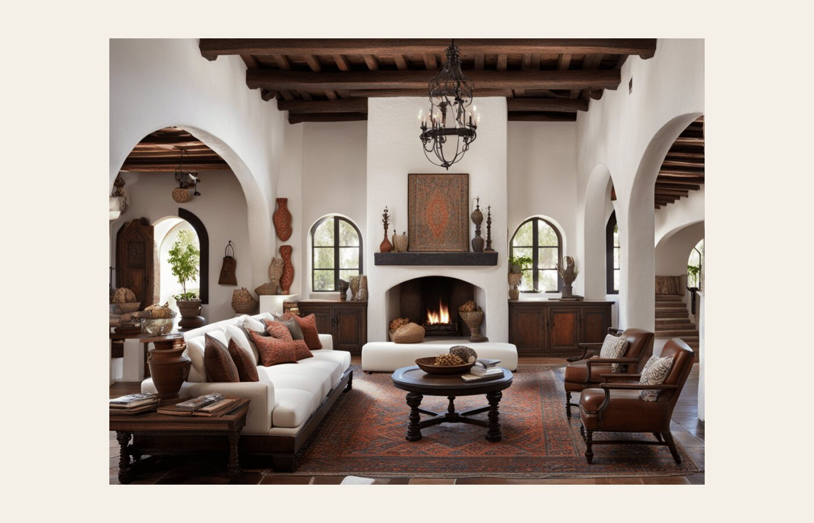

**视觉理解**：厚墙、庭院、拱门、深木梁和铁艺形成强烈的遮阳、围合与阴影感。

**装修与布置**：砂色、陶红、深木；抹灰、陶砖、深木和铁艺；圆拱、木梁、手工砖；家具厚实。

**Aily 可执行翻译**：保留厚度和深阴影，减少轻薄冷金属；拱形必须与真实开口或墙体关系一致；控制深木比例保证采光。

**容易做丑**：把拱形贴在任意墙上；冷灰铬色与厚重结构冲突；仿古材料太新太亮。

**适合**：层高、采光和空间尺度允许，喜欢庄重南欧氛围的住户。
知识来源：[US National Park Service — Spanish Missions Architecture](https://www.nps.gov/subjects/travelspanishmissions/architecture-and-preservation.htm) · 图片来源：[Cardinal Memorials — Spanish Style House](https://cardinalmemorials.com/home-decor-aesthetic-style-guide/spanish-style-house/)（视觉检索）

## 19. 托斯卡纳 Tuscan

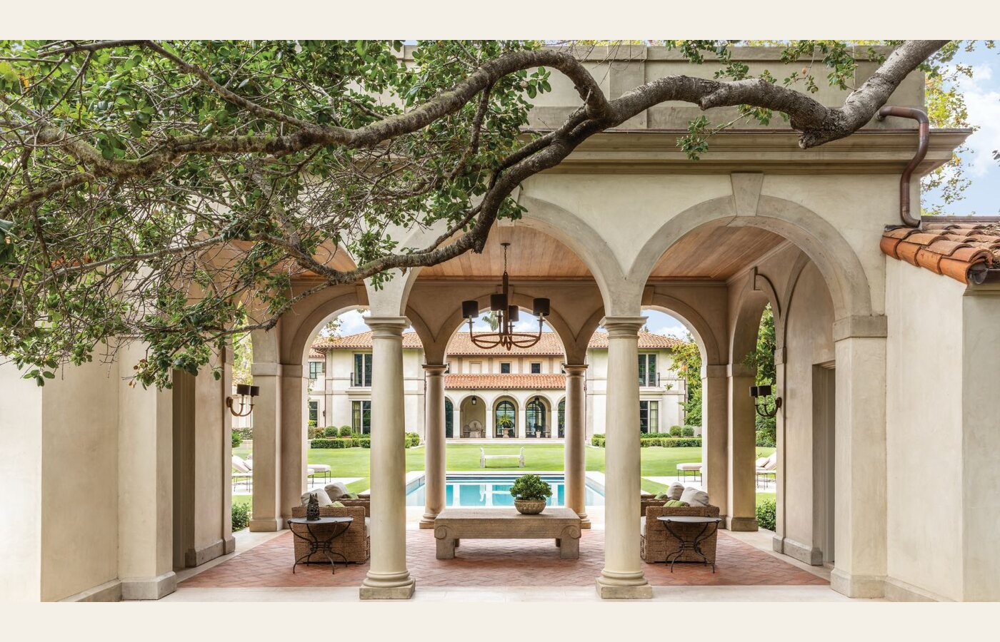

**视觉理解**：围绕餐厨、壁炉和家庭聚会组织，材料呈现乡野、日晒和时间感。

**装修与布置**：赭石、蜂蜜木、橄榄绿、砖红；石、灰泥、陶砖、木梁和铁艺；厚实木桌柜。

**Aily 可执行翻译**：把最强材料集中在餐厨或公共空间；保留石、木、灰泥的真实差异；用自然光和暖低位光代替全屋黄光。

**容易做丑**：满屋褐黄；仿古贴皮；所有表面同时做旧。

**适合**：喜欢家庭聚会、暖土色和乡野质感的住户。
知识与图片来源：[Homes & Gardens — Tuscan House Style](https://www.homesandgardens.com/interior-design/what-is-a-tuscan-house-style)

## 20. 维多利亚极繁 Victorian Maximalist

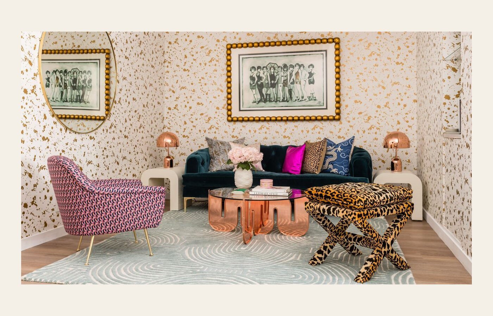

**视觉理解**：丰富的颜色、图案、收藏和历史轮廓通过层级组织；极繁不等于没有空白和焦点。

**装修与布置**：宝石色、深红绿蓝与金；深木、天鹅绒、黄铜、彩玻璃；繁复线脚、壁纸、厚窗帘和多盏装饰灯。

**Aily 可执行翻译**：建立主色、重复色和收藏焦点；给每组物件分配展示和收纳区域；保持通道、门窗和高频操作面清楚。

**容易做丑**：所有收藏平均铺开；没有重复色；维护成本被忽略。

**适合**：收藏丰富、愿意维护、喜欢强故事感的住户。
知识与图片来源：[Architectural Digest — Maximalist Interior Design 101](https://www.architecturaldigest.com/story/maximalist-interior-design-101)

## 21. 侘寂 Wabi-sabi

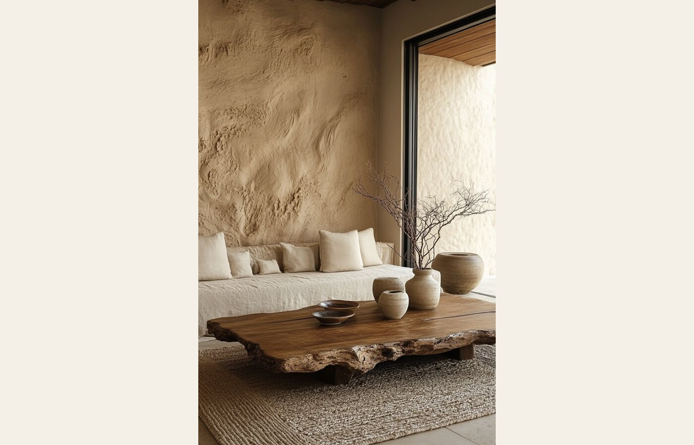

**视觉理解**：接受时间、修补与材料不完美，通过留白和柔光让细微变化被看见。

**装修与布置**：泥土色、灰褐、炭色；旧木、手工陶、粗石和亚麻；不均匀抹灰、自然纹理地面；家具低矮。

**Aily 可执行翻译**：记录住户对斑驳、节疤和修补痕迹的接受度；只在可控、可维护的材料上保留不均匀；减少装饰数量。

**容易做丑**：把破旧、开裂和施工缺陷包装成侘寂；全屋灰泥却没有材质对比。

**适合**：喜欢安静、自然老化和手工物件的住户。
知识来源：[Architectural Digest — Japandi Style 101](https://www.architecturaldigest.com/story/japandi-style-101)（相邻语境，需后续补更专门文献） · 图片来源：[Pinterest 搜索结果](https://www.pinterest.com/pin/57069120275172533/)（仅视觉辨识）

## 22. 新中式 New Chinese

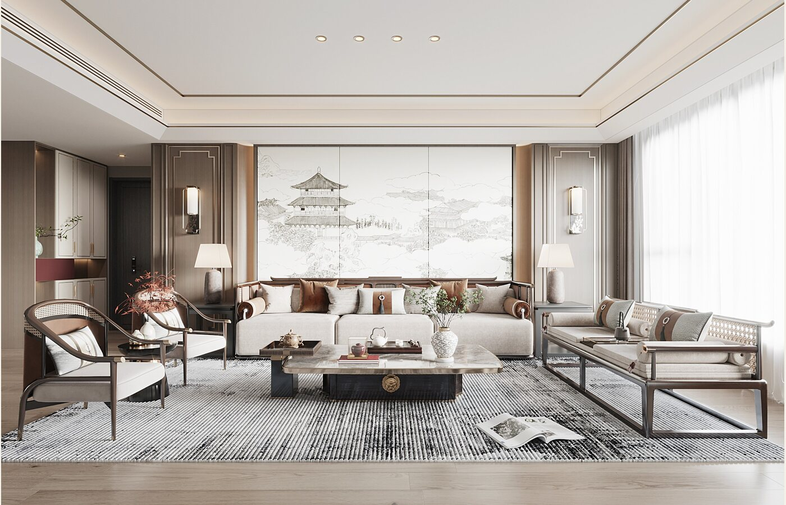

**视觉理解**：把轴线、框景、虚实分区和明式家具比例现代化，重点是空间秩序，不是贴中国符号。

**装修与布置**：木色、墨色、米白和低饱和红绿；硬木、石、纸、丝织物和黄铜；木格栅、留白墙、石木地面。

**Aily 可执行翻译**：先建立视线、轴线和框景关系；家具用明式比例的轻量简化；书画、陶瓷只做少量点景；避免厚重红木成套。

**容易做丑**：山水画、格栅和红木符号贴满；空间被厚家具压暗。

**适合**：重视秩序、文化氛围、书画与留白的住户。
知识来源：[The Met — Chinese Furniture Collection](https://www.metmuseum.org/art/collection/search/39493) · 图片来源：[拓者设计吧 — 新中式客厅](https://www.tuozhe8.com/thread-1730288-1-1.html)（视觉检索）

## 23. 海岸风 Coastal

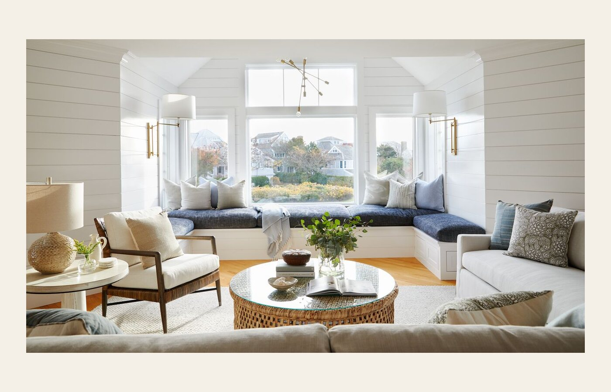

**视觉理解**：轻盈、通风、日光和自然纹理，比“蓝白海洋主题”更接近日常住宅。

**装修与布置**：白、沙色、雾蓝；浅木、亚麻、黄麻和藤；白墙、浅木或浅石地面；家具轻体量。

**Aily 可执行翻译**：保持窗景和风路径；用纹理而不是道具表现海岸感；优先可洗织物和耐晒材料。

**容易做丑**：锚、船舵、贝壳等主题化；全白导致没有层次。

**适合**：采光好、偏放松、希望维护轻松的家庭。
知识与图片来源：[Architectural Digest — Coastal Interior Design 101](https://www.architecturaldigest.com/story/coastal-interior-design-101)

## 24. 农舍风 Farmhouse

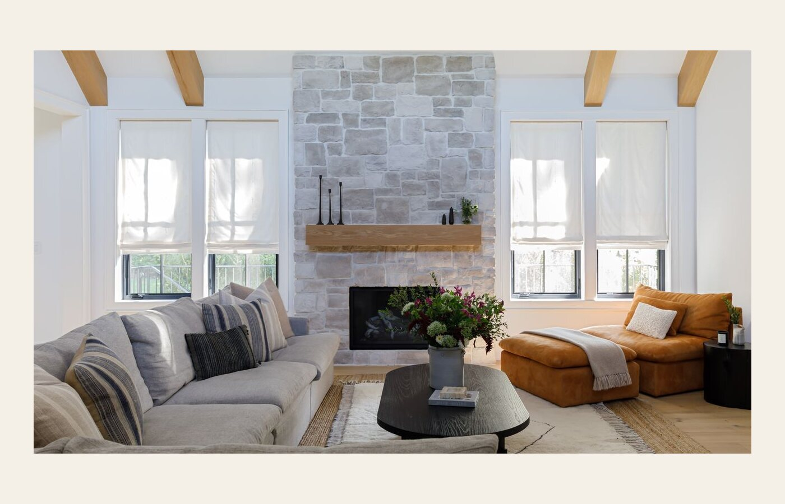

**视觉理解**：以家庭活动、大餐桌和耐用材料为核心，强调务实与新旧混搭。

**装修与布置**：奶油、灰白、旧木；旧木、砖、棉麻和铁；木板墙或简单抹灰、耐用地面；开放收纳。

**Aily 可执行翻译**：从家庭人数、餐厨活动和清洁方式出发；高频区域使用可维护材料；旧物与现代设备并置。

**容易做丑**：标语牌和乡村道具代替设计；开放收纳超过维护能力。

**适合**：家庭活动频繁、重视耐用和亲切感的住户。
知识与图片来源：[Architectural Digest — Farmhouse Style 101](https://www.architecturaldigest.com/story/farmhouse-style-101)

## 25. 原木粗犷 Rustic

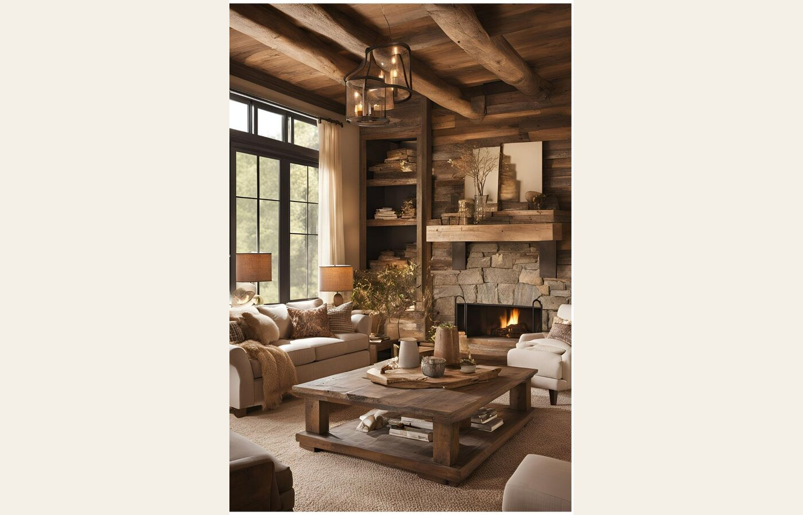

**视觉理解**：让未抛光木、石、自然边和加工痕迹成为主角，空间具有重量和火炉感。

**装修与布置**：土色、木色、石灰色；粗石墙、裸木梁、哑光地面；家具厚实耐用。

**Aily 可执行翻译**：确认结构与墙体能否承载厚重表面；优先真实材料和局部焦点；控制粗糙面在触摸、清洁和防尘上的风险。

**容易做丑**：塑料贴皮模拟天然材料；每个表面都粗糙；忽略采光与清洁。

**适合**：喜欢天然材料、厚重包裹感和低精致度表面的住户。
知识来源：[House Beautiful — Rustic Design](https://www.housebeautiful.com/design-inspiration/a23937828/rustic-design-style/) · 图片来源：[Pinterest 搜索结果](https://ca.pinterest.com/pin/225954106298743873/)（仅视觉辨识）

## 26. 波西米亚折衷 Bohemian Eclectic

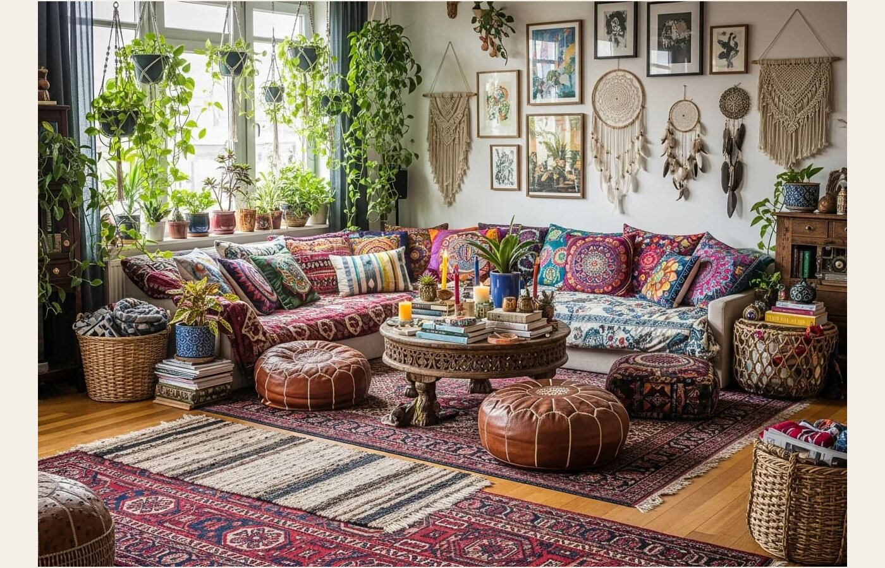

**视觉理解**：围绕旅行收藏、手工物和放松生活自由组合，但仍需要重复色与材质作为秩序。

**装修与布置**：浓郁土色、宝石色、多色纹样；藤、木、羊毛、棉和手工陶；图案地毯、艺术墙、复古家具。

**Aily 可执行翻译**：先记录住户真实收藏；以 2–3 个重复色、2 种主材质统一；为植物、织物和开放陈列计算维护负担。

**容易做丑**：所有物件同时抢焦点；把大量采购新品伪装成旅行收藏。

**适合**：收藏多、喜欢色彩和非正式布局、愿意整理维护的住户。
知识来源：[House Beautiful — Bohemian Design](https://www.housebeautiful.com/design-inspiration/a23748087/what-is-bohemian-design-style/) · 图片来源：[HanoDecor — Bohemian Room Planner](https://hanodecor.com/tools/room-planner)（合成视觉示意）

## 27. 摩洛哥风 Moroccan

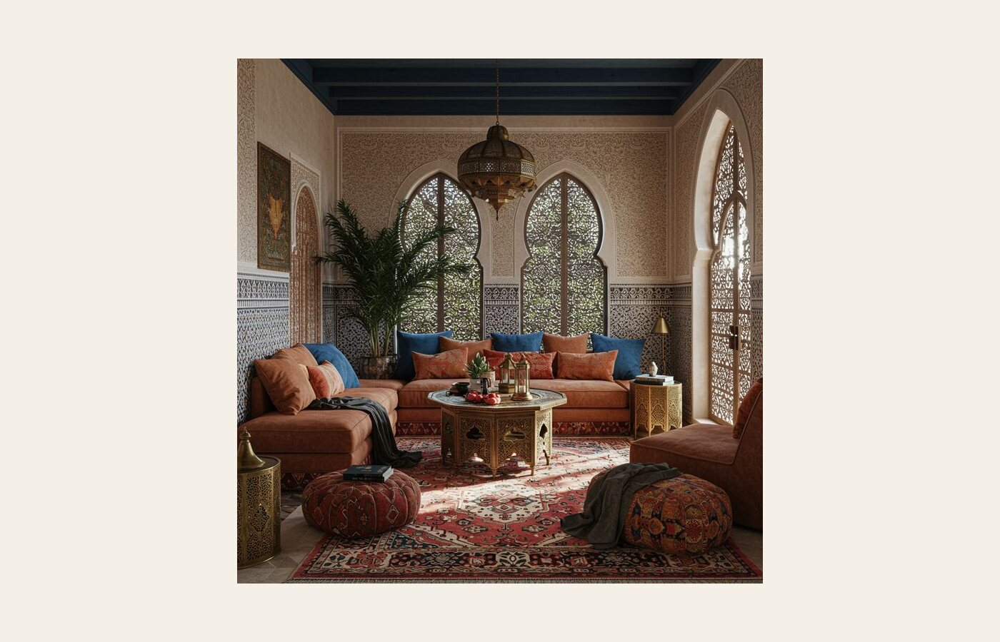

**视觉理解**：围合、庭院、低座交谈、几何拼花和光影工艺共同形成浓烈空间体验。

**装修与布置**：钴蓝、绿、赭红和白；zellige 瓷砖、雕花灰泥、雪松、黄铜；马蹄拱、低座和穿孔金属灯。

**Aily 可执行翻译**：把高工艺表面集中在入口、壁龛或一个焦点区；低座布局需校验起坐人体工学；拼花必须使用可生产模数。

**容易做丑**：用印刷贴纸代替真实拼砖与雕刻；颜色和纹样同时失控。

**适合**：喜欢围合、强工艺、浓色和夜间灯影的住户或局部空间。
知识来源：[The Met — Moroccan Court](https://www.metmuseum.org/about-the-met/collection-areas/islamic-art/the-moroccan-court) · 图片来源：[Pinterest 搜索结果](https://fr.pinterest.com/pin/980869993850673277/)（仅视觉辨识）

## 28. 巴厘热带 Balinese Tropical

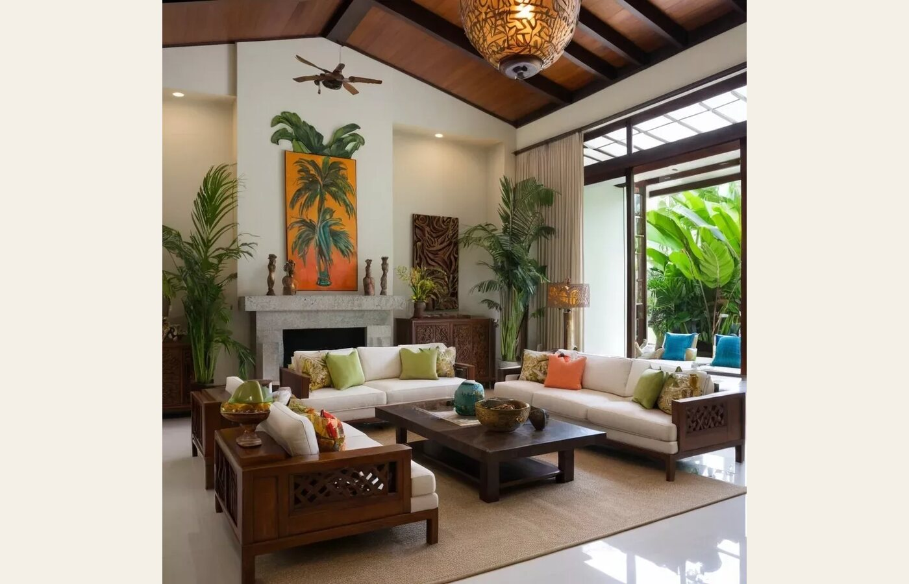

**视觉理解**：跨通风、深檐、庭院、半室外过渡和耐湿天然材料共同服务热带气候。

**装修与布置**：木色、石色、植物绿；柚木、竹、藤、火山石和亚麻；木格栅、大开口、室内外兼用家具。

**Aily 可执行翻译**：必须先读取气候、朝向、雨水、湿度和虫害条件；布置应形成对流；材料要有耐湿与维护标签；非热带地区只能提取局部语言。

**容易做丑**：在寒冷干燥气候无条件复制开放边界；室内堆大量热带植物却没有光照和排水。

**适合**：热湿气候、具备庭院或大开口、重视室内外生活的住户。
知识来源：[ArchDaily — Tropical Architecture](https://www.archdaily.com/tag/tropical-architecture) · 图片来源：[Pinterest 搜索结果](https://www.pinterest.com/pin/14988611254820931/)（仅视觉辨识）

---

## 风水如何进入系统，而不污染设计规则

风水在这套数据里是 `cultural_overlay`，默认关闭，不宣称效果，也不是建筑规范。只有住户明确表示在意后，Aily 才追问：

- 入户视线、遮挡和迎宾秩序；
- 床与门窗、镜面和主要通道的相对关系；
- 灶、水槽、门窗和厨房动线；
- 镜面对床、入口、灶或主要活动区的反射；
- 主要动线是否希望更迂回、私密或具有层次。

处理顺序固定为：**结构与安全规则 → 人体工学与设备规则 → 企业产品/施工规则 → 住户硬约束 → 风水偏好 → 风格偏好**。风水不能推翻前面的任何一层。

参考：[UNESCO — Honghe Hani Rice Terraces cultural landscape](https://whc.unesco.org/en/list/1113)；[Heliyon — Feng shui review](https://www.sciencedirect.com/science/article/pii/S2405844023067403)。这两项只能说明其文化/研究背景，不能用来宣称住宅效果。

## 我建议怎样把图谱用于 Aily Harness

1. **不要让用户先选 28 选 1。** Aily 先问生活方式、收纳、光线、色彩、维护和预算，再推 2–3 个候选方向。
2. **允许混合，但要有主次。** 例如 `主风格=北欧 70% + 辅风格=中世纪现代 30%`；历史工艺型风格要限制混合数量。
3. **把墙顶地纳入输出。** 每次方案必须同时返回 `空间布局、墙顶地、固定木作、家具、照明、软装`，不能只换家具。
4. **输出可验证参数。** 包括材质来源、颜色区间、表面光泽、家具高度线、装饰密度、开放度、维护等级和预算等级。
5. **遇到条件不成立就降级。** 例如小户型粗野主义改为“局部混凝土焦点 + 轻家具”，寒冷地区巴厘热带改为“暖木/石/藤语言 + 封闭保温边界”。
6. **每轮生成两个合法方向。** 一个更接近审美，一个更接近日常约束，并清楚说明代价。
7. **禁止把图片直接当答案。** 图片只用于视觉对齐；最终场景必须回到房屋文件树、坐标、表面、家具、材料与规则中。

## 当前数据的真实边界

- 已有：28 套风格身份、特征、11 维倾向评分、知识来源、文化叠加边界，以及每套独立视觉参考图。
- 尚缺：欧派真实材料/SKU/工艺/报价映射；中国不同地区气候与施工差异；针对儿童、老人、无障碍和宠物的专门风格适配规则。
- 需要后续补强：侘寂的独立权威来源；Pinterest/AI 视觉示意图替换为可授权、可商用或原创资产。
- 不能宣称：这些图就是欧派产品、这些风格已经能真实报价、或 Aily 已具备专业设计师的完整知识。

## 图片资产说明

`docs/design-style-atlas/images/` 保存检索到的原始参考图；`docs/design-style-atlas/plates/` 保存统一到 1400×900 画布的审阅版，共 28 张。它们仅用于内部研究和风格对齐，不应直接进入商业产品。正式上线前应替换为欧派授权素材、明确可商用素材或原创生成资产。
